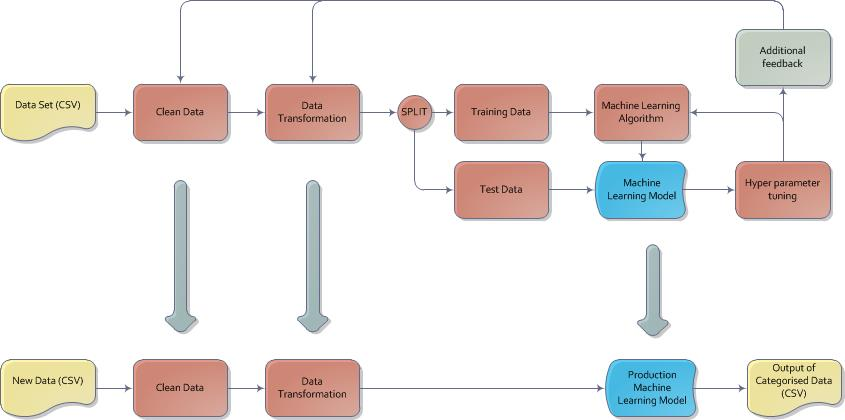

# Bank transaction automatic category tagging

The project is inpired by automatic tagging of transaction records by major banks.

## Project Brief

We will break down the project into three disctint steps

1. Natural Language Processing (NLP) to vectorise the descriptions column of the transaction
2. Manual Clustering to identify the distinct categories based on the description of the each transaction
3. Classification of transaction records based on the above found disctinc categories

## Project Steps

Following are the break down of taks for this project
- Load data
- Clean data
- Explore data
    - Find the column which describes the transation
- NLP
- Clustering - done manually for now by visuall means
- Classifcation
- Testing
- Evaluation
- Production pipeline

## Model building flow

## References

- Natural Language Processing module in General Assembly Data Science Course
- [Machine Learning, NLP: Text Classification using scikit-learn, python and NLTK](https://towardsdatascience.com/machine-learning-nlp-text-classification-using-scikit-learn-python-and-nltk-c52b92a7c73a)
- [NLP in Python by Alice Zhao - PyOhio](https://www.youtube.com/watch?v=xvqsFTUsOmc)
    - [Tutorial notebook](https://github.com/adashofdata/nlp-in-python-tutorial)
- [Australian Post codes repository](https://www.matthewproctor.com/australian_postcodes)
